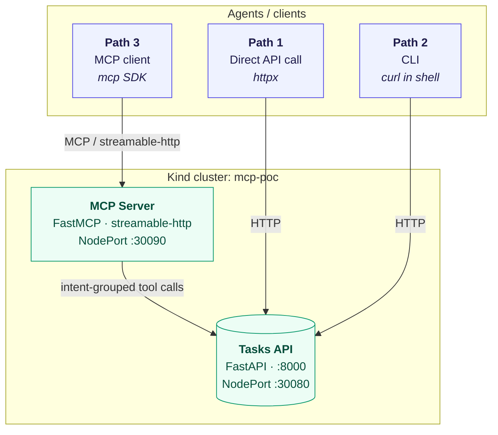

# MCP Production PoC

[](https://www.python.org/downloads/)
[](https://kind.sigs.k8s.io/)
[](https://modelcontextprotocol.io/)
[](#license)

> **A hands-on lab that proves why production agents converge on MCP — by deploying the same backend behind all three integration paths (Direct API, CLI, MCP) on a real Kubernetes cluster.**

Built to teach the patterns from Anthropic's [*Building agents that reach production systems with MCP*](https://claude.com/blog/building-agents-that-reach-production-systems-with-mcp).

---

## Architecture



The Tasks API plays the role of "the production system." The MCP server wraps it with **intent-grouped tools** rather than mirroring its endpoints — the central design lesson of the article.

---

## Prerequisites

Pin these versions for a reproducible lab:

- [ ] **Docker Desktop** ≥ 4.30 — [macOS](https://docs.docker.com/desktop/install/mac-install/) · [Windows](https://docs.docker.com/desktop/install/windows-install/)
- [ ] **Kind** ≥ 0.24 — [install guide](https://kind.sigs.k8s.io/docs/user/quick-start/#installation)
- [ ] **kubectl** ≥ 1.31 — [install guide](https://kubernetes.io/docs/tasks/tools/)
- [ ] **uv** ≥ 0.5 — [install guide](https://docs.astral.sh/uv/getting-started/installation/)
- [ ] **Python** 3.12+ (only needed if you want to run the example clients locally)

> **Windows users:** run `scripts/*.sh` from Git Bash, WSL, or any POSIX shell. PowerShell users can invoke the same commands with `sh scripts/setup.sh`.

---

## Quickstart

```bash
# 0. (Optional) Verify required tools are installed
make check

# 1. Boot the cluster, build images, deploy everything
make deploy

# 2. Path 1 — Direct API call
uv run --python 3.12 --with httpx python examples/direct_api.py

# 3. Path 2 — CLI
sh examples/cli_demo.sh

# 4. Path 3 — MCP
uv run --python 3.12 --with mcp python examples/mcp_client.py
```

Total time from zero to all three paths working: **under 5 minutes** on a warm Docker cache.

---

## What You'll See

**Path 1 — Direct API**

```
Created task 4: Review PR #42
Completed task 4 with note: approved and merged
```

**Path 2 — CLI**

```
{"id":5,"title":"Roll out feature flag", ... ,"status":"done","note":"flag enabled at 10%"}
Completed task 5 via CLI.
```

**Path 3 — MCP**

```
Discovered intent-grouped tools:
  - list_open_tasks: Return every task that is not yet done, ordered by API insertion order.
  - triage_new_task: Create a task and return it ready for work.
  - complete_task_with_note: Mark a task as done and attach a closing note in a single call.

Triage result: id=6 title='Investigate latency spike'
Completion result: status=done note='rolled back the bad release'
```

Notice how the MCP client never touches HTTP semantics or endpoint paths — it only speaks **intents**.

---

## Project Structure

```
.
├── README.md                              # You are here
├── kind-config.yaml                       # Single-node Kind cluster with NodePorts exposed
├── k8s/                                   # Plain Kubernetes manifests
│   ├── namespace.yaml                     # mcp-poc namespace
│   ├── tasks-api-deployment.yaml          # FastAPI backend deployment
│   ├── tasks-api-service.yaml             # NodePort 30080 -> backend
│   ├── mcp-server-deployment.yaml         # FastMCP server deployment
│   └── mcp-server-service.yaml            # NodePort 30090 -> MCP server
├── scripts/
│   ├── setup.sh                           # One-command bootstrap
│   └── teardown.sh                        # Clean destruction
├── services/
│   ├── tasks_api/                         # The "production system"
│   │   ├── pyproject.toml                 # uv-managed, FastAPI + uvicorn
│   │   ├── Dockerfile                     # Multi-stage, non-root, pinned versions
│   │   ├── src/tasks_api/main.py          # CRUD-style HTTP API for tasks
│   │   └── tests/test_main.py             # Smoke tests
│   └── mcp_server/                        # The integration layer
│       ├── pyproject.toml                 # uv-managed, mcp + httpx
│       ├── Dockerfile                     # Multi-stage, non-root, pinned versions
│       ├── src/mcp_server/api_client.py   # HTTP transport for the Tasks API
│       ├── src/mcp_server/server.py       # FastMCP server with intent-grouped tools
│       └── tests/test_tools.py            # Verifies the intent-grouping invariant
└── examples/
    ├── direct_api.py                      # Path 1: bare HTTP from Python
    ├── cli_demo.sh                        # Path 2: curl in a shell
    └── mcp_client.py                      # Path 3: MCP streamable-http client
```

---

## How It Works

**Why three paths against one backend?** The article's framing is that mature integrations ship all three. Putting them side-by-side makes it obvious *which* trade-offs each path makes.

**Why intent-grouped tools matter.** The Tasks API exposes five endpoints. Mirroring them one-to-one would force the agent to chain three calls just to "complete a task with a note": `GET /tasks/{id}` → `PATCH /tasks/{id}` (status) → `PATCH /tasks/{id}` (note). The MCP server collapses that into a single `complete_task_with_note(task_id, note)` tool. Fewer round-trips, less context spent on choreography, fewer chances for the agent to go off-rails.

**Why FastMCP with streamable-http?** It's the recommended transport for production MCP deployments — works across web, mobile, and cloud-hosted agents, and is the configuration every major client is optimized to consume.

**Why Kind?** Identical Kubernetes semantics on macOS and Windows with no cloud bill. The cluster is a single node with NodePorts (30080, 30090) mapped straight to localhost so students don't need port-forward tutorials before they see anything work.

---

make destroy

```bash
sh scripts/teardown.sh
```

That deletes the entire Kind cluster — no leftover containers, networks, or volumes.

---

## Troubleshooting

| Symptom | Likely cause | Fix |
|---|---|---|
| `kind: command not found` | Kind not installed or not on `PATH` | Follow the [install guide](https://kind.sigs.k8s.io/docs/user/quick-start/#installation), then re-open your shell |
| `connection refused` on `localhost:30080` | Cluster came up but pods aren't ready yet | `kubectl -n mcp-poc get pods -w` and wait for `Running` |
| Image pull errors like `ErrImageNeverPull` | Image wasn't loaded into the Kind cluster | Re-run `sh scripts/setup.sh` — it re-loads the images |

---

## Next Steps

Once the lab is running, try these extensions to deepen your understanding of the patterns from the article:

1. **Add a fourth intent-grouped tool** — e.g., `reassign_high_priority_tasks(from_user, to_user)`. Notice how the LLM-facing surface stays small even as capability grows.
2. **Try the MCP Inspector** against `http://localhost:30090/mcp` — `npx -y @modelcontextprotocol/inspector` lets you poke the server interactively.
3. **Read [Writing tools for agents](https://www.anthropic.com/engineering/writing-tools-for-agents)** — the deep dive behind the intent-grouped pattern.
4. **Explore [tool search and programmatic tool calling](https://www.anthropic.com/engineering/advanced-tool-use)** — the client-side context-efficiency patterns the article highlights.

---

## License

MIT.
